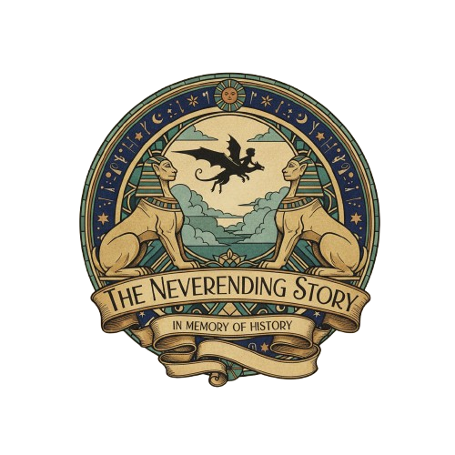

# DosEsfingesBot - Rust Implementation



Bot de Zulip para competencias de Machine Learning estilo Kaggle, implementado en Rust.

## 🚀 Características

- ✅ Gestión de envíos de modelos con validación de CSV
- 📊 Cálculo automático de ganancias usando matriz de confusión
- 🏆 Leaderboard con estadísticas completas
- 🔍 Detección de envíos duplicados
- 👥 Roles diferenciados: estudiantes y profesores
- ⏰ Control de fecha límite
- 💾 Almacenamiento en SQLite
- 🔐 Checksums SHA-256 para archivos

## 📋 Requisitos

- Rust 1.70 o superior
- Cuenta de Zulip con API key

## 🛠️ Instalación

```bash
# Clonar o copiar los archivos del proyecto
cd dos_esfinges_bot

# Compilar en modo release
cargo build --release
```

## ⚙️ Configuración

### 1. Crear archivo de configuración

```bash
 ./target/release/dos_esfinges_bot create-config 
```

Esto creará un archivo `config.json` de ejemplo.

### 2. Editar config.json

```json
{
  "zulip": {
    "email": "tu-bot@example.com",
    "api_key": "tu-api-key",
    "site": "https://tu-org.zulipchat.com"
  },
  "database": {
    "path": "dos_esfinges.db"
  },
  "logs": {
    "path": "logs"
  },
  "teachers": [
    "profesor1@example.com",
    "profesor2@example.com"
  ],
  "master_data": {
    "path": "master_data.csv"
  },
  "submissions": {
    "path": "./submissions"
  },
  "gain_matrix": {
    "tp": 1.0,
    "tn": 0.5,
    "fp": -0.1,
    "fn_": -0.5
  },
  "gain_thresholds": [
    {
      "min_gain": 100,
      "category": "excellent",
      "message": "¡Modelo excepcional!",
      "gifs": [
        "https://media.giphy.com/media/your-gif/giphy.gif"
      ]
    }
  ],
  "competition": {
    "name": "Competencia ML 2025",
    "description": "Descripción de la competencia",
    "deadline": "2025-12-31T23:59:59Z"
  }
}
```

### 3. Preparar datos maestros

Crear `master_data.csv` con el formato:

```csv
id,clase_binaria
1,0
2,1
3,0
...
```

## 🏃 Ejecución

```bash
# Modo desarrollo con logs detallados
RUST_LOG=info cargo run -- run --config config.json

# Modo producción
./target/release/dos_esfinges_bot run --config config.json
```

## 📝 Comandos del Bot

### Para Estudiantes

- `submit <nombre> <ganancia_esperada>` - Enviar modelo (adjuntar CSV)
- `list submits` - Listar tus envíos
- `help` - Mostrar ayuda

**Formato del CSV de envío:**
- 1 columna con los IDs predichos como positivos
- Sin encabezado
- Ejemplo:
  ```
  123
  456
  789
  ```

### Para Profesores

Todos los comandos de estudiantes, más:

- `duplicates` - Listar envíos duplicados
- `leaderboard` - Leaderboard completo con estadísticas
- `user submits <email_o_nombre>` - Ver envíos de un usuario específico


## 📊 Matriz de Ganancias

El bot calcula la ganancia usando:

```
Ganancia = TP × gain_tp + TN × gain_tn + FP × gain_fp + FN × gain_fn
```

Donde:
- TP: True Positives
- TN: True Negatives
- FP: False Positives
- FN: False Negatives

## 🎯 Categorías de Umbral

Los envíos se clasifican en categorías según la ganancia. Cada categoría puede tener:
- Mensaje personalizado
- GIFs aleatorios

## 🔒 Chequeos

- Validación de IDs contra dataset maestro
- Checksums SHA-256 para detectar duplicados
- Control de fecha límite

## 📄 Licencia

MIT License
